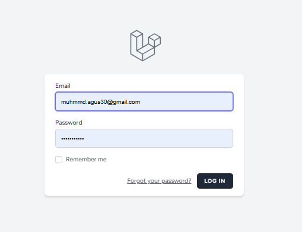
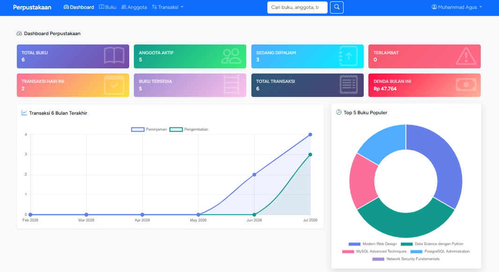
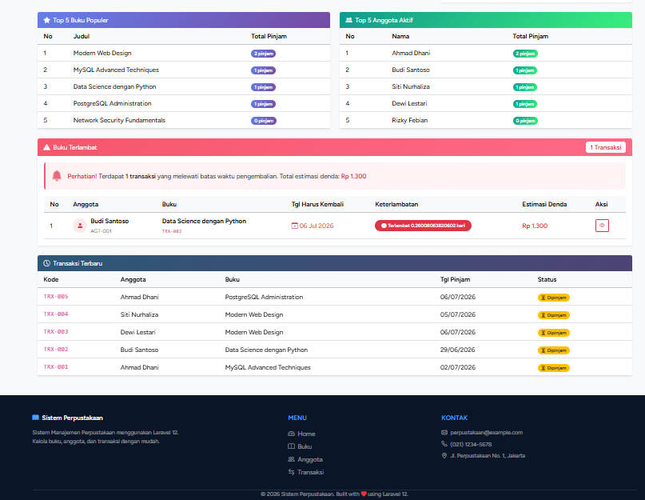
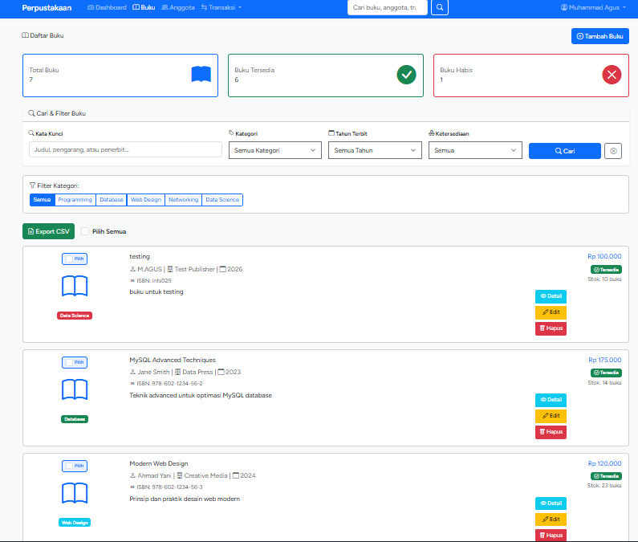
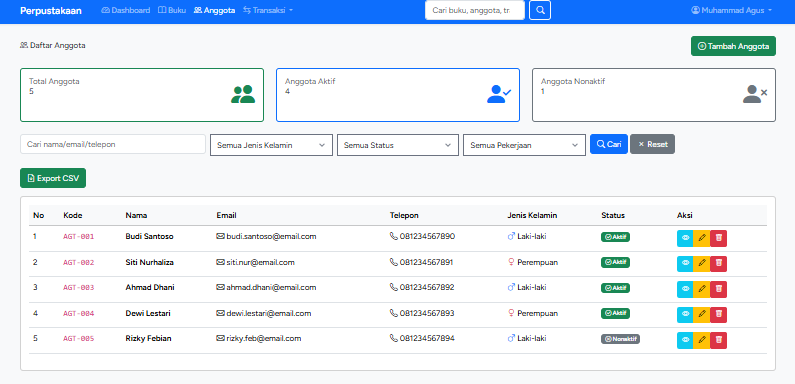
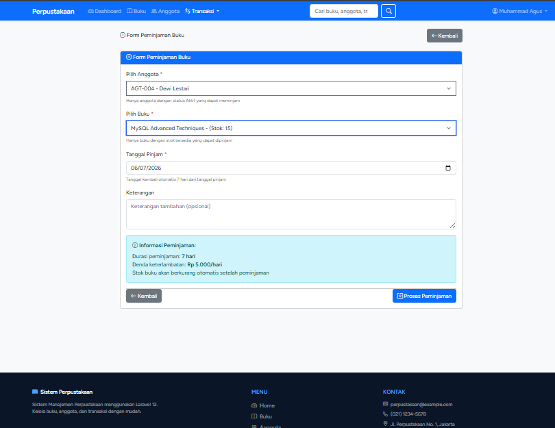
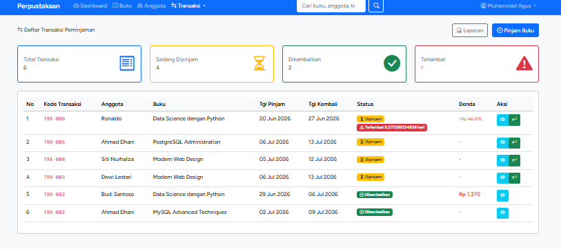
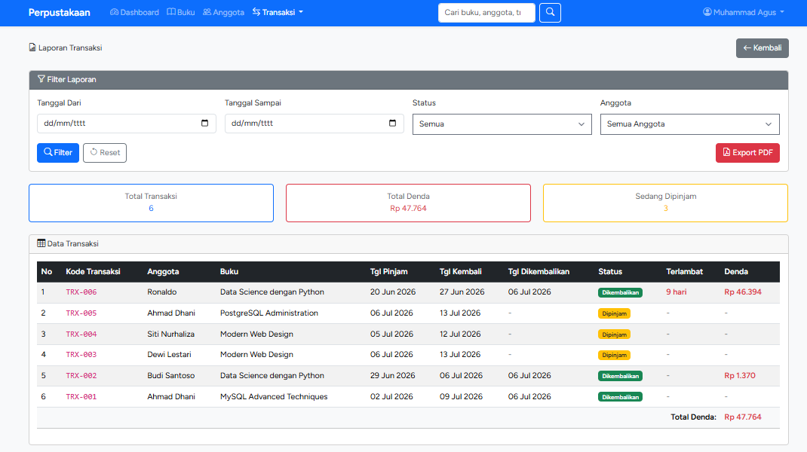
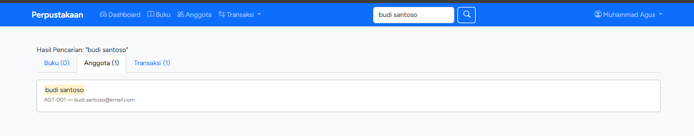

# 📚 Sistem Manajemen Perpustakaan Digital

Aplikasi Sistem Manajemen Perpustakaan berbasis web yang dibangun menggunakan **Laravel 13**. Aplikasi ini menyediakan fitur lengkap untuk mengelola data buku, anggota, transaksi peminjaman & pengembalian, laporan, serta notifikasi keterlambatan.

---

## 📋 Daftar Isi

- [Fitur Utama](#-fitur-utama)
- [Tech Stack](#-tech-stack)
- [Persyaratan Sistem](#-persyaratan-sistem)
- [Instalasi](#-instalasi)
- [Struktur Database](#-struktur-database)
- [Dokumentasi Tampilan](#-dokumentasi-tampilan)
- [Struktur Folder](#-struktur-folder)

---

## ✨ Fitur Utama

### 🔐 Autentikasi
- Login & Register menggunakan Laravel Breeze
- Middleware proteksi halaman (auth)
- Manajemen profil pengguna

### 📖 Manajemen Buku (CRUD)
- Tambah, edit, hapus, dan lihat detail buku
- Filter berdasarkan kategori (Programming, Database, Web Design, Networking, Data Science)
- Pencarian buku
- Export data buku ke CSV
- Bulk delete (hapus massal)
- Informasi stok real-time

### 👥 Manajemen Anggota (CRUD)
- Tambah, edit, hapus, dan lihat detail anggota
- Pencarian anggota
- Export data anggota ke Excel
- Status anggota (Aktif/Nonaktif)
- Accessor otomatis: umur, lama anggota, kategori usia

### 📋 Transaksi Peminjaman & Pengembalian
- Peminjaman buku dengan kode transaksi otomatis (TRX-XXX)
- Pengembalian buku dengan konfirmasi SweetAlert
- Perhitungan tanggal kembali otomatis (7 hari)
- Perhitungan denda otomatis (Rp 5.000/hari keterlambatan)
- Manajemen stok otomatis (berkurang saat dipinjam, bertambah saat dikembalikan)

### ⚠️ Notifikasi Terlambat
- Dashboard widget **"Buku Terlambat"** dengan daftar lengkap transaksi terlambat
- Jumlah transaksi yang terlambat ditampilkan di statistik dashboard
- List anggota yang terlambat beserta detail buku, tanggal, dan estimasi denda
- Badge **"Terlambat X hari"** di halaman index transaksi
- Alert peringatan di halaman detail transaksi jika melewati tanggal kembali
- Estimasi denda real-time

### 📊 Dashboard & Statistik
- Total buku, anggota aktif, transaksi, buku tersedia
- Jumlah sedang dipinjam dan terlambat
- Denda bulan ini dan transaksi hari ini
- Grafik transaksi 6 bulan terakhir (Chart.js - Line Chart)
- Top 5 buku populer (Chart.js - Doughnut Chart)
- Top 5 anggota aktif
- Transaksi terbaru

### 📈 Laporan
- Laporan transaksi dengan filter (tanggal, status, anggota)
- Export laporan ke PDF (DomPDF)
- Ringkasan statistik (total, dipinjam, dikembalikan, total denda)

### 🔍 Global Search
- Pencarian lintas modul (buku, anggota, transaksi) dalam satu halaman
- Pencarian berdasarkan judul, pengarang, ISBN, nama, email, kode transaksi

---

## 🛠 Tech Stack

| Teknologi | Versi | Keterangan |
|-----------|-------|------------|
| **PHP** | 8.3+ | Runtime bahasa pemrograman |
| **Laravel** | 13.x | Framework PHP utama |
| **Laravel Breeze** | 2.4 | Scaffolding autentikasi |
| **MySQL** | 8.x | Database relasional |
| **Bootstrap** | 5.3.3 | CSS framework untuk UI |
| **Bootstrap Icons** | 1.11.3 | Icon library |
| **Chart.js** | Latest | Library grafik/chart |
| **SweetAlert2** | 11 | Library popup/konfirmasi |
| **DomPDF** | 3.1 | Export PDF |
| **Maatwebsite Excel** | 3.1 | Export Excel |
| **Vite** | Latest | Build tool frontend |

---

## 📌 Persyaratan Sistem

- PHP >= 8.3
- Composer
- Node.js & NPM
- MySQL / MariaDB
- Laragon (disarankan untuk Windows)

---

## 🚀 Instalasi

### 1. Clone Repository

```bash
git clone https://github.com/username/perpustakaan.git
cd perpustakaan
```

### 2. Install Dependencies

```bash
composer install
npm install
```

### 3. Konfigurasi Environment

```bash
cp .env.example .env
php artisan key:generate
```

Edit file `.env` dan sesuaikan konfigurasi database:

```env
DB_CONNECTION=mysql
DB_HOST=127.0.0.1
DB_PORT=3306
DB_DATABASE=perpustakaan
DB_USERNAME=root
DB_PASSWORD=
```

### 4. Migrasi Database

```bash
php artisan migrate
```

### 5. Build Asset Frontend

```bash
npm run build
```

### 6. Jalankan Aplikasi

```bash
php artisan serve
```

Akses aplikasi di: `http://localhost:8000`

---

## 🗄 Struktur Database

### Tabel `buku`

| Kolom | Tipe | Keterangan |
|-------|------|------------|
| id | bigint (PK) | Primary key |
| kode_buku | varchar(20) | Kode unik buku |
| judul | varchar(200) | Judul buku |
| kategori | enum | Programming, Database, Web Design, Networking, Data Science |
| pengarang | varchar(100) | Nama pengarang |
| penerbit | varchar(100) | Nama penerbit |
| tahun_terbit | year | Tahun terbit |
| isbn | varchar(20) | ISBN (nullable) |
| harga | decimal(10,2) | Harga buku |
| stok | integer | Jumlah stok |
| deskripsi | text | Deskripsi buku (nullable) |
| bahasa | varchar(20) | Bahasa buku (default: Indonesia) |
| timestamps | | created_at & updated_at |

### Tabel `anggota`

| Kolom | Tipe | Keterangan |
|-------|------|------------|
| id | bigint (PK) | Primary key |
| kode_anggota | varchar(20) | Kode unik anggota |
| nama | varchar(100) | Nama lengkap |
| email | varchar(100) | Email (unique) |
| telepon | varchar(15) | Nomor telepon |
| alamat | text | Alamat lengkap |
| tanggal_lahir | date | Tanggal lahir |
| jenis_kelamin | enum | Laki-laki / Perempuan |
| pekerjaan | varchar(50) | Pekerjaan (nullable) |
| tanggal_daftar | date | Tanggal mendaftar |
| status | enum | Aktif / Nonaktif |
| timestamps | | created_at & updated_at |

### Tabel `transaksis`

| Kolom | Tipe | Keterangan |
|-------|------|------------|
| id | bigint (PK) | Primary key |
| kode_transaksi | varchar(20) | Kode unik transaksi (TRX-XXX) |
| anggota_id | bigint (FK) | Relasi ke tabel anggota |
| buku_id | bigint (FK) | Relasi ke tabel buku |
| tanggal_pinjam | date | Tanggal peminjaman |
| tanggal_kembali | date | Tanggal batas pengembalian |
| tanggal_dikembalikan | date | Tanggal dikembalikan (nullable) |
| status | enum | Dipinjam / Dikembalikan |
| denda | integer | Jumlah denda (default: 0) |
| keterangan | text | Catatan tambahan (nullable) |
| timestamps | | created_at & updated_at |

### Relasi Antar Tabel

```
┌──────────┐       ┌──────────────┐       ┌──────────┐
│  anggota │──1:N──│  transaksis  │──N:1──│   buku   │
└──────────┘       └──────────────┘       └──────────┘
```

- **Anggota** memiliki banyak **Transaksi** (hasMany)
- **Buku** memiliki banyak **Transaksi** (hasMany)
- **Transaksi** dimiliki oleh satu **Anggota** (belongsTo)
- **Transaksi** dimiliki oleh satu **Buku** (belongsTo)

---


## 📸 Dokumentasi Tampilan

### 1. Halaman Login

Halaman autentikasi pengguna menggunakan Laravel Breeze dengan desain modern.



---

### 2. Dashboard Profesional

tampilan halaman dashboard.





---

### 3. Manajemen Buku

Halaman pengelolaan data buku dengan fitur CRUD, pencarian, filter kategori, dan export.



---

### 4. Manajemen Anggota

Halaman pengelolaan data anggota perpustakaan dengan fitur CRUD dan export.



---

### 5. Form Peminjaman Buku

Form untuk membuat transaksi peminjaman buku baru dengan validasi lengkap.



---

### 6. Daftar Transaksi

Halaman daftar semua transaksi peminjaman dengan badge status dan notifikasi keterlambatan.



---

### 7. Laporan Transaksi

Halaman laporan transaksi dengan filter tanggal, status, anggota, serta fitur export PDF.



---

### 8. Global Search

Fitur pencarian global lintas modul (buku, anggota, transaksi) dalam satu halaman.



---

## 📁 Struktur Folder

```
perpustakaan/
├── app/
│   ├── Exports/              # Export classes (Excel)
│   ├── Http/
│   │   └── Controllers/
│   │       ├── BukuController.php
│   │       ├── AnggotaController.php
│   │       ├── TransaksiController.php
│   │       ├── DashboardController.php
│   │       ├── SearchController.php
│   │       └── LaporanController.php
│   └── Models/
│       ├── Buku.php
│       ├── Anggota.php
│       └── Transaksi.php
├── database/
│   └── migrations/           # File migrasi database
├── resources/
│   └── views/
│       ├── layouts/          # Template layout (app, nav, footer)
│       ├── buku/             # Views CRUD buku
│       ├── anggota/          # Views CRUD anggota
│       ├── transaksi/        # Views transaksi & laporan
│       ├── search/           # View global search
│       ├── laporan/          # View laporan
│       ├── auth/             # Views autentikasi
│       └── dashboard.blade.php
├── routes/
│   └── web.php               # Definisi semua route
├── image/                    # Screenshot dokumentasi
└── ...
```

---

## AUTHOR

- **Nama : Muhammad Agus**
- **NIM : 60324026**
- **Mata Kuliah : Pemrograman Web II**
- **Tugas : Proyek Akhir- Sistem Informasi Perpustakaan**

