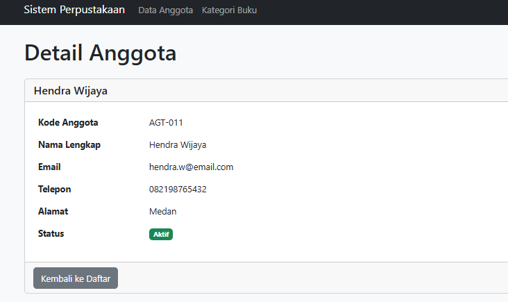
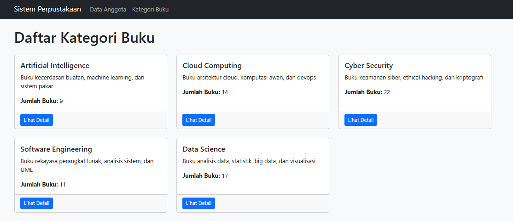
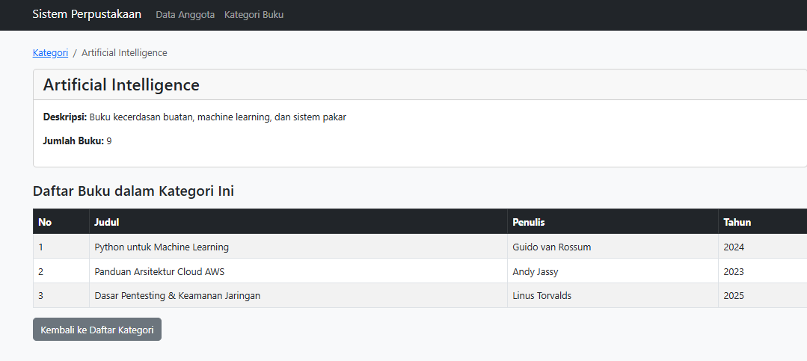
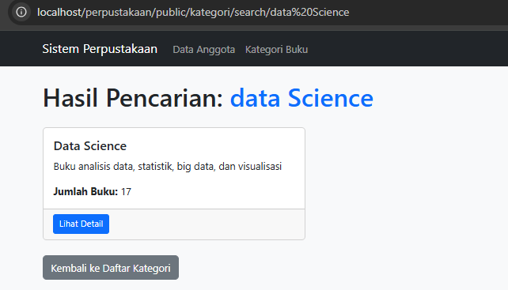

# Tugas Pertemuan 9: Pengenalan Framework Laravel & MVC

---

## 👤 Identitas Mahasiswa
* **Nama:** Muhammad Agus
* **NIM:** 60324026
* **Kelas:** B

---

## 💻 Daftar Endpoint & Konfigurasi Routing (URL)

Berikut adalah pemetaan seluruh *route* yang terdaftar di dalam file `routes/web.php` beserta fungsi dan penamaannya (*named routes*):

| HTTP Method | URL Path | Nama Route (`name`) | Controller / Closure | Deskripsi Tampilan / Fitur |
| :--- | :--- | :--- | :--- | :--- |
| **GET** | `/` | *-* | *Closure* | Halaman selamat datang (*welcome page*) bawaan Laravel. |
| **GET** | `/perpustakaan` | *-* | `PerpustakaanController@index` | Menampilkan dashboard utama dan daftar 5 koleksi buku informatika. |
| **GET** | `/buku/{id}` | *-* | `PerpustakaanController@show` | Menampilkan informasi detail spesifik buku (penerbit, tahun, deskripsi). |
| **GET** | `/about` | *-* | `PerpustakaanController@about` | Halaman informasi sistem perpustakaan dan identitas *developer*. |
| **GET** | `/anggota` | `anggota.index` | *Closure* | Menampilkan tabel daftar 5 anggota perpustakaan baru (Hendra, Citra, dll). |
| **GET** | `/anggota/{id}`| `anggota.show` | *Closure* | Menampilkan kartu profil (*card*) detail lengkap dan status aktif anggota. |
| **GET** | `/kategori` | `kategori.index` | `KategoriController@index` | Menampilkan grid kartu (*card*) rumpun kategori buku baru (AI, Cloud, dll). |
| **GET** | `/kategori/{id}`| `kategori.show` | `KategoriController@show` | Menampilkan detail deskripsi kategori beserta daftar buku di dalamnya. |
| **GET** | `/kategori/search/{keyword}` | `kategori.search` | `KategoriController@search` | Menampilkan hasil pencarian kategori yang cocok dengan *keyword* (*highlighted*). |

## 📸 Dokumentasi Antarmuka (Screenshot)

Berikut adalah bukti pengerjaan implementasi sistem yang telah disinkronkan:

### 1. Tugas 1: Modul Anggota Perpustakaan
* **Halaman Daftar Anggota (Index):**
  Menampilkan seluruh data 5 anggota baru dalam bentuk tabel Bootstrap 5.
  

* **Halaman Detail Anggota (Show):**
  Menampilkan informasi lengkap spesifik anggota menggunakan komponen Card Bootstrap 5.
  

---

### 2. Tugas 2: Modul Kategori Buku (MVC)
* **Halaman Daftar Kategori (Index):**
  Menampilkan visualisasi rumpun kategori baru informatika dalam bentuk Grid Card.
  

* **Halaman Detail Kategori & Buku (Show):**
  Menampilkan deskripsi kategori beserta relasi daftar koleksi buku di dalamnya.
  

* **Halaman Hasil Pencarian Kategori (Search):**
  Menampilkan hasil pencarian kategori yang cocok dengan kata kunci yang dimasukkan oleh pengguna.
  